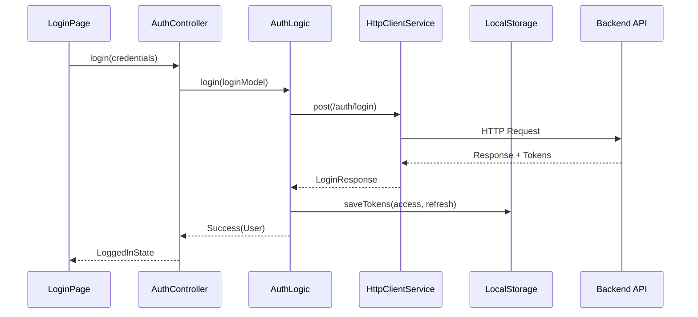
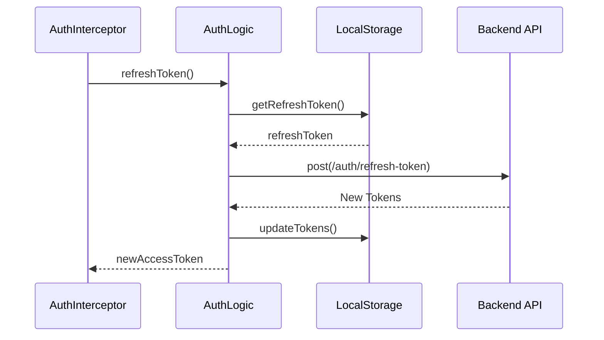

# Documentação de Arquitetura - App MP Prof

## 📋 Índice
1. [Visão Geral](#visão-geral)
2. [Arquitetura do Sistema](#arquitetura-do-sistema)
3. [Estrutura de Pastas](#estrutura-de-pastas)
4. [Camadas da Aplicação](#camadas-da-aplicação)
5. [Fluxo de Dados](#fluxo-de-dados)
6. [Padrões e Convenções](#padrões-e-convenções)
7. [Gerenciamento de Estado](#gerenciamento-de-estado)
8. [Injeção de Dependências](#injeção-de-dependências)
9. [Autenticação e Autorização](#autenticação-e-autorização)
10. [Tratamento de Erros](#tratamento-de-erros)
11. [Testes](#testes)
12. [Refatorações Implementadas](#refatorações-implementadas)

---

## 🎯 Visão Geral

### Propósito
O **App MP Prof** é um aplicativo móvel desenvolvido em Flutter para profissionais de saúde, permitindo o gerenciamento de agendamentos, visualização de timelines de pacientes e funcionalidades administrativas.

### Tecnologias Principais
- **Frontend**: Flutter 3.32.7 / Dart 3.8.1
- **Gerenciamento de Estado**: ViewModels com ReactiveBuilder e Command Pattern
- **Navegação**: GoRouter 16.0.0 com injeção de dependências via rotas
- **HTTP Client**: Dio 5.8.0 centralizado no MedplusApi
- **Banco Local**: ObjectBox 4.3.0
- **Injeção de Dependência**: GetIt 8.0.3 com isolamento entre camadas
- **Armazenamento Local**: SharedPreferences 2.5.3

---

## 🏗️ Arquitetura do Sistema

### Clean Architecture + MVVM Modernizada
O projeto segue os princípios da **Clean Architecture** combinada com **MVVM (Model-View-ViewModel)** com as seguintes modernizações:

```
┌─────────────────────────────────────────────────────────────┐
│                    UI LAYER                                 │
│  ┌─────────────┐  ┌─────────────┐                          │
│  │   Widgets   │  │ ViewModels  │                          │
│  │ (Stateful/  │  │ (Commands+  │                          │
│  │ ReactiveB)  │  │    DI)      │                          │
│  └─────────────┘  └─────────────┘                          │
└─────────────────────────────────────────────────────────────┘
                              │
┌─────────────────────────────────────────────────────────────┐
│                   DOMAIN LAYER                             │
│  ┌─────────────┐  ┌─────────────┐                          │
│  │   Models    │  │  UseCases   │                          │
│  │ (Business   │  │(Conditional)│                          │
│  │  Entities)  │  │             │                          │
│  └─────────────┘  └─────────────┘                          │
└─────────────────────────────────────────────────────────────┘
                              │
┌─────────────────────────────────────────────────────────────┐
│                    DATA LAYER                              │
│  ┌─────────────┐  ┌─────────────┐  ┌─────────────────────┐  │
│  │Repositories │  │   Services  │  │    ApiModels        │  │
│  │(Implements) │  │             │  │                     │  │
│  └─────────────┘  └─────────────┘  └─────────────────────┘  │
└─────────────────────────────────────────────────────────────┘
                              │
┌─────────────────────────────────────────────────────────────┐
│                 EXTERNAL LAYER                             │
│  ┌─────────────┐  ┌─────────────┐  ┌─────────────────────┐  │
│  │External APIs│  │SharedPrefs  │  │  Other Services     │  │
│  │             │  │             │  │                     │  │
│  └─────────────┘  └─────────────┘  └─────────────────────┘  │
└─────────────────────────────────────────────────────────────┘
```

---

## 📁 Estrutura de Pastas

```
lib/
├── ui/                            # UI Layer
│   ├── widgets/                   # Widgets reutilizáveis e páginas
│   └── viewmodels/                # ViewModels com Commands
├── domain/                        # Domain Layer
│   ├── models/                    # Modelos de negócio
│   └── usecases/                  # UseCases (quando necessário)
├── data/                          # Data Layer
│   ├── repositories/              # Implementações de repositórios
│   ├── services/                  # Serviços (MedplusApi, LocalStorage)
│   └── models/                    # ApiModels para serialização
├── utils/                         # Commands e Result (utilitários)
├── routes/                        # Configuração de rotas
└── dependencies/                  # Injeção de dependências
```

---

## 🔄 Camadas da Aplicação

### 1. **UI Layer**
**Responsabilidade**: Interface do usuário e interação

**Componentes**:
- **Widgets**: Páginas e componentes reutilizáveis (`LoginPage`, `AppDrawer`, `LoginForm`)
- **ViewModels**: Gerenciam estado e lógica de apresentação (`AuthViewModel`, `AgendamentosViewModel`)

**Exemplo**:
```dart
class AuthViewModel extends ChangeNotifier {
  final IAuthLogic _authLogic;
  
  // Commands for reactive operations - initialized inline
  late final loginCommand = Command1<void, LoginDto>(_login);
  late final logoutCommand = Command0<void>(_logout);
  
  Future<void> _login(LoginDto loginDto) async {
    final result = await _authLogic.login(loginDto);
    result.fold(
      (user) => /* Handle success */,
      (error) => /* Handle error */,
    );
  }
  
  Future<void> _logout() async {
    // Logout logic
  }
}
```

#### **Command Pattern**
Commands encapsulam operações assíncronas com estado reativo:

**Tipos de Commands**:
- `Command0<T>`: Sem parâmetros - `Command0<void>(_method)`
- `Command1<T,A>`: Um parâmetro - `Command1<List<Data>, String>(_method)`
- Para múltiplos parâmetros: usar DTOs/records

**Exemplo de uso**:
```dart
// No ViewModel
late final loadDataCommand = Command1<List<Item>, int>(_loadData);

// No Widget  
ReactiveBuilder<MyViewModel>(
  notifier: viewModel,
  builder: (context, vm) {
    if (vm.loadDataCommand.running) return CircularProgressIndicator();
    if (vm.loadDataCommand.error) return ErrorWidget();
    return ListView(children: vm.items.map(ItemWidget.new).toList());
  },
)

// Executar comando
viewModel.loadDataCommand.execute(userId);
```

### 2. **Domain Layer**
**Responsabilidade**: Regras de negócio e modelos da aplicação

**Componentes**:
- **Models**: Objetos de negócio (`User`, `Agendamento`, `Paciente`)
- **UseCases**: Casos de uso específicos quando necessário (conforme regras estabelecidas)

**Exemplo**:
```dart
// Model de domínio
class User {
  final int id;
  final String nome;
  final String email;
  
  User({required this.id, required this.nome, required this.email});
}

// UseCase apenas quando necessário (múltiplos repos, lógica complexa, reutilização)
class ProcessarAgendamentoCompletoUseCase {
  final AgendamentosRepository _agendamentosRepo;
  final PacientesRepository _pacientesRepo;
  
  Future<Result<AgendamentoCompleto>> execute(int id) async {
    // Combina dados de múltiplos repositórios
  }
}
```

### 3. **Data Layer**
**Responsabilidade**: Acesso e manipulação de dados

**Componentes**:
- **Repositories**: Implementações concretas das interfaces de acesso a dados
- **Services**: Serviços que se comunicam com APIs externas, SharedPreferences e outros recursos
- **ApiModels**: Modelos específicos para serialização/deserialização de dados da API

**Exemplo**:
```dart
// Repository implementação
class AuthRepository implements IAuthRepository {
  final MedplusApi _medplusApi;
  final LocalStorageService _localStorage;
  
  Future<Result<User>> login(LoginDto loginDto) async {
    final result = await _medplusApi.login(loginDto);
    // Processar resposta e retornar modelo de domínio
  }
}

// Service que se comunica com externos
class MedplusApi {
  final Dio _dio;
  
  Future<Result<LoginResponse>> login(LoginDto loginDto) async {
    // Comunicação com API externa
  }
}

// ApiModel para serialização
class LoginResponse {
  final String accessToken;
  final String refreshToken;
  final UserApiModel user;
  
  factory LoginResponse.fromJson(Map<String, dynamic> json) => // ...
}
```

### 4. **External Layer**
**Responsabilidade**: Recursos externos e infraestrutura

**Componentes**:
- **External APIs**: APIs REST externas
- **SharedPreferences**: Armazenamento local de configurações
- **Other Services**: Banco de dados local, cache, etc.

**Exemplo**:
```dart
// Comunicação com API externa
final response = await http.post('https://api.medplus.com/login');

// Armazenamento local
await SharedPreferences.getInstance().setString('token', accessToken);

// Banco local
final box = Hive.box('agendamentos');
```

---

## 📊 Fluxo de Dados

### Fluxo de Autenticação


### Fluxo de Refresh Token


---

## 📐 Padrões e Convenções

### 1. **Result Pattern**
Utilização do padrão Result para tratamento de erros:

```dart
// Usando result_dart
Future<Result<User, HandledException>> login() async {
  try {
    final user = await api.login();
    return Success(user);
  } catch (e) {
    return Failure(HandledException(e.message));
  }
}
```

### 2. **State Pattern**
Estados bem definidos para cada controller:

```dart
abstract class BaseState {}
class InitialState extends BaseState {}
class LoadingState extends BaseState {}
class ErrorState extends BaseState {
  final String message;
  ErrorState(this.message);
}
class LoggedInState extends BaseState {
  final User user;
  LoggedInState(this.user);
}
```

### 3. **Nomenclatura**
- **Classes**: PascalCase (`AuthController`, `LoginPage`)
- **Métodos/Variáveis**: camelCase (`getUserData`, `isLoading`)
- **Constantes**: UPPER_SNAKE_CASE (`API_BASE_URL`)
- **Arquivos**: snake_case (`auth_controller.dart`)

---

## 🔄 Gerenciamento de Estado

### StateNotifier Pattern
Implementação customizada inspirada no Riverpod:

```dart
abstract class StateNotifier<T> extends ChangeNotifier {
  T _state;
  
  T get state => _state;
  
  void update(T newState) {
    _state = newState;
    notifyListeners();
  }
}
```

### Fluxo de Estado
1. **UI** chama método no **Controller**
2. **Controller** atualiza estado para `LoadingState`
3. **Controller** chama **Logic/UseCase**
4. **Logic** processa e retorna resultado
5. **Controller** atualiza estado baseado no resultado

---

## 💉 Injeção de Dependências

### GetIt Configuration
Sistema centralizado de DI usando GetIt:

```dart
Future<void> setupInjector(ApiConfig apiConfig) async {
  i.addSingleton<ApiConfig>(apiConfig);
  await _injectServices(apiConfig);
  await _injectRepositories();
  await _injectLogic();
  await _injectControllers();
  await _injectUseCases();
}
```

### Ordem de Injeção
1. **Services** (HttpClient, LocalStorage)
2. **Repositories** (Data access)
3. **Logic** (Business logic)
4. **Controllers** (ViewModels)
5. **UseCases** (Specific operations)

### Resolução de Dependência Circular
Problema comum resolvido com Dio básico:

```dart
// Evita dependência circular entre AuthLogic e HttpClient
Dio _buildBasicDio(ApiConfig apiConfig) {
  final dio = Dio();
  dio.interceptors.add(InterceptorsWrapper(
    onRequest: (options, handler) async {
      final token = await localStorage.getAccessToken();
      if (token != null) {
        options.headers['Authorization'] = 'Bearer $token';
      }
      handler.next(options);
    },
  ));
  return dio;
}
```

---

## 🔐 Autenticação e Autorização

### JWT Token Management
Sistema completo de gerenciamento de tokens:

**Armazenamento Seguro**:
```dart
abstract class ILocalStorage {
  Future<void> setAccessToken(String token);
  Future<void> setRefreshToken(String refreshToken);
  Future<String?> getAccessToken();
  Future<String?> getRefreshToken();
  Future<void> clearTokens();
}
```

**Refresh Automático**:
```dart
class AuthInterceptor extends Interceptor {
  @override
  void onError(DioException err, ErrorInterceptorHandler handler) async {
    if (err.response?.statusCode == 401) {
      final refreshResult = await authLogic.refreshToken();
      // Retry request with new token
    }
  }
}
```

### Proteção de Rotas
Sistema de redirecionamento baseado em estado de autenticação:

```dart
Future<String?> _redirect(BuildContext context, GoRouterState state) async {
  final loggedIn = injector<AuthRepository>().user != null;
  
  if (!loggedIn && !isPublicRoute(state.matchedLocation)) {
    return AppRoutes.login;
  }
  
  return null;
}
```

---

## ⚠️ Tratamento de Erros

### Hierarquia de Exceções
```dart
abstract class AppException implements Exception {
  final String message;
  AppException(this.message);
}

class HandledException extends AppException {
  HandledException(super.message);
}

class UnhandledException extends AppException {
  UnhandledException(super.message);
}

class ApiException extends HandledException {
  final int statusCode;
  ApiException(super.message, this.statusCode);
}
```

### Error Boundaries
Tratamento em camadas:

1. **UI Layer**: Exibe mensagens de erro amigáveis
2. **Controller Layer**: Converte exceções em estados
3. **Logic Layer**: Trata erros de negócio
4. **Service Layer**: Trata erros de comunicação

---

## 🧪 Testes

### Estrutura de Testes
```
test/
├── unit/                          # Testes unitários
│   ├── controllers/               # Testes de controllers
│   ├── logic/                     # Testes de lógica de negócio
│   └── services/                  # Testes de serviços
├── widget/                        # Testes de widgets
├── integration/                   # Testes de integração
└── mock/                          # Mocks e dados de teste
```

### Estratégia de Testes
- **Unit Tests**: Lógica de negócio e controllers
- **Widget Tests**: Componentes de UI
- **Integration Tests**: Fluxos completos
- **Mocking**: Usando Mockito para dependências

**Exemplo de Teste**:
```dart
group('AuthController Tests', () {
  late AuthController controller;
  late MockAuthLogic mockAuthLogic;

  setUp(() {
    mockAuthLogic = MockAuthLogic();
    controller = AuthController(mockAuthLogic);
  });

  test('should update state to LoggedIn when login succeeds', () async {
    // Arrange
    when(mockAuthLogic.login(any))
        .thenAnswer((_) async => Success(mockUser));

    // Act
    await controller.login(loginDto);

    // Assert
    expect(controller.state, isA<LoggedInState>());
  });
});
```

---

## 🚀 Deploy e CI/CD

### Ambientes
- **Development**: Configuração local
- **Staging**: Ambiente de testes
- **Production**: Ambiente de produção

### Build Configuration
```dart
// main_staging.dart
void main() async {
  WidgetsFlutterBinding.ensureInitialized();
  await setupInjector(StagingApi());
  runApp(const MyApp());
}

// main.dart (production)
void main() async {
  WidgetsFlutterBinding.ensureInitialized();
  await setupInjector(ProductionApi());
  runApp(const MyApp());
}
```

### Configuração Android
- **Gradle**: 8.11.1
- **Kotlin**: 2.1.0
- **Java**: 17
- **Android Gradle Plugin**: 8.7.3

---

## 📈 Métricas e Monitoramento

### Performance
- **Build Time**: ~2-3 minutos
- **App Size**: Target < 50MB
- **Startup Time**: Target < 3 segundos

### Logging
```dart
// Interceptor para logging de requisições
dio.interceptors.add(LogInterceptor(
  responseBody: true,
  requestBody: true,
  logPrint: (object) => logger.d(object),
));
```

---

## 🔄 Versionamento e Migrations

### Database Migrations
ObjectBox migrations para mudanças de schema:

```dart
// Exemplo de migration
@Entity()
class User {
  @Id()
  int id = 0;
  
  String nome;
  String token;
  String refreshToken; // Campo adicionado em v2
}
```

### API Versioning
Suporte a múltiplas versões da API:

```dart
class ApiConfig {
  final String apiUrl;
  final String version;
  
  String get baseUrl => '$apiUrl/$version';
}
```

---

## � Refatorações Implementadas

### 1. **Controller → ViewModel Migration**

#### ❌ **Antes (Legacy Controllers)**
```dart
class AgendamentosController extends StateNotifier {
  // Lógica complexa misturada
  // Estados difíceis de testar
  // Múltiplas responsabilidades
}
```

#### ✅ **Depois (ViewModels com Commands)**
```dart
class AgendamentosViewModel extends ChangeNotifier {
  // Commands para operações específicas
  late final Command0 carregarAgendamentosAutomatico;
  late final Command1<DateTime, void> selecionarData;
  
  // Injeção de dependências clara
  AgendamentosViewModel(
    this._getAgendamentosUseCase,
    this._atualizarDataUseCase,
    this._limparAgendamentosUseCase,
    this._getClinicaSelecionadaUseCase,
    this._agendamentosRepository,
  ) {
    // Configuração dos commands
  }
}
```

### 2. **StateBuilder → ReactiveBuilder Migration**

#### ❌ **Antes (StateBuilder em todas as páginas)**
```dart
StateBuilder<AgendamentosController>(
  builder: (context, controller) {
    // Widgets rebuilt desnecessariamente
    // Performance impactada
  },
)
```

#### ✅ **Depois (ReactiveBuilder otimizado)**
```dart
ReactiveBuilder(
  builder: (context) {
    final viewModel = context.read<AgendamentosViewModel>();
    // Rebuilds otimizados
    // Melhor performance
  },
)
```

**📋 Regra**: StateBuilder **SOMENTE** em validadores de formulário.

### 3. **API Service Consolidation**

#### ❌ **Antes (Múltiplos serviços)**
```dart
// Múltiplos serviços com Dio próprio
class AgendamentosApiService {
  final Dio _dio;
  // Duplicação de configuração
}

class PacientesApiService {
  final Dio _dio;
  // Configurações inconsistentes
}
```

#### ✅ **Depois (MedplusApi centralizado)**
```dart
class MedplusApi {
  final Dio _dio; // Dio único com interceptors

  Future<Result<LoginResponse>> login(LoginDto loginDto) async {}
  Future<Result<List<Agendamento>>> getAgendamentosDoDia() async {}
  Future<Result<Map<String, String>>> refreshToken() async {}
  // Todos os métodos de API centralizados
}
```

### 4. **Repository Isolation Rules**

#### ❌ **Antes (Dependências entre repositórios)**
```dart
class AgendamentosRepository {
  final ClinicasRepository _clinicasRepo; // ❌ Violação
  final PacientesRepository _pacientesRepo; // ❌ Violação
}
```

#### ✅ **Depois (Isolamento completo)**
```dart
class AgendamentosRepository {
  final MedplusApi _medplusApi; // ✅ Apenas serviços externos
  // ❌ NUNCA outros repositórios
}

// Regra: Repositórios NÃO podem depender de outros repositórios
```

### 5. **Dependency Injection via Router**

#### ❌ **Antes (Service Locator pattern)**
```dart
class AgendamentosPage extends StatelessWidget {
  Widget build(context) {
    final viewModel = GetIt.instance<AgendamentosViewModel>(); // ❌
    // Dependências implícitas
  }
}
```

#### ✅ **Depois (Explicit DI via Routes)**
```dart
// No router_config.dart
GoRoute(
  path: '/agendamentos',
  builder: (context, state) => AgendamentosPage(
    viewModel: AgendamentosViewModel(
      GetIt.instance(), // Explicit dependencies
      GetIt.instance(),
      GetIt.instance(),
    ),
  ),
)

class AgendamentosPage extends StatelessWidget {
  final AgendamentosViewModel viewModel;
  const AgendamentosPage({required this.viewModel}); // ✅ Explicit
}
```

### 6. **UseCase Optimization**

#### 📋 **Regras Fundamentais dos UseCases:**

**1. UseCases SOMENTE quando atender uma ou mais condições específicas**
**2. UseCases NÃO devem executar outros UseCases**
**3. UseCases NÃO devem receber outros UseCases por injeção de dependências**

#### ✅ **Criar UseCases APENAS quando uma ou mais das condições existir:**

**🔀 Condição 1: Precisa combinar dados de múltiplos repositórios**
```dart
// ✅ UseCase NECESSÁRIO - combina dados de vários repositórios
class ProcessarAgendamentoCompletoUseCase {
  final AgendamentosRepository _agendamentosRepo;
  final PacientesRepository _pacientesRepo;
  final ClinicasRepository _clinicasRepo;
  
  Future<Result<AgendamentoCompleto>> execute(int id) async {
    // Combina dados de 3 repositórios diferentes
    final agendamento = await _agendamentosRepo.getById(id);
    final paciente = await _pacientesRepo.getById(agendamento.pacienteId);
    final clinica = await _clinicasRepo.getById(agendamento.clinicaId);
    
    return AgendamentoCompleto.combinar(agendamento, paciente, clinica);
  }
}
```

**🧠 Condição 2: Lógica excessivamente complexa**
```dart
// ✅ UseCase NECESSÁRIO - lógica muito complexa
class CalcularEstatisticasAvancadasUseCase {
  Future<Result<EstatisticasCompletas>> execute() async {
    // Múltiplos cálculos complexos
    final dados = await _agendamentosRepo.getTodosAgendamentos();
    
    // Algoritmos complexos de análise
    final mediaTempoEspera = _calcularMediaComVariancia(dados);
    final tendencias = _analisarTendenciasTrimestre(dados);
    final predicoes = _gerarPredicoesMachineLearning(dados);
    
    return EstatisticasCompletas(mediaTempoEspera, tendencias, predicoes);
  }
}
```

**♻️ Condição 3: Lógica reutilizada por diferentes ViewModels**
```dart
// ✅ UseCase NECESSÁRIO - reutilização entre múltiplos ViewModels
class ValidarAgendamentoDisponivelUseCase {
  Future<Result<bool>> execute(DateTime data, int medicoId) async {
    // Lógica complexa de validação de disponibilidade
    // Usada por: AgendamentosViewModel, CalendarioViewModel, RelatóriosViewModel
    final conflitos = await _verificarConflitos(data, medicoId);
    final restricoes = await _verificarRestricoesMedico(medicoId);
    final limitesHorario = await _verificarLimitesHorario(data);
    
    return _validarDisponibilidade(conflitos, restricoes, limitesHorario);
  }
}
```

#### ❌ **NÃO criar UseCases quando:**
- **Operação simples de CRUD** (buscar, salvar, deletar)
- **Chamada direta para um único repository**
- **Transformação simples de dados**
- **Lógica usada apenas por um ViewModel**

#### ❌ **ANTI-PATTERN - UseCase desnecessário:**
```dart
// ❌ DESNECESSÁRIO - operação simples, apenas um repositório
class GetAgendamentosUseCase {
  final AgendamentosRepository _repository;
  
  Future<Result<List<Agendamento>>> execute() async {
    return await _repository.getAgendamentos(); // Simples demais!
  }
}

// ✅ FAZER DIRETO no ViewModel
class AgendamentosViewModel extends ChangeNotifier {
  Future<void> _carregarAgendamentos() async {
    final result = await _agendamentosRepository.getAgendamentos();
    // Direto e simples
  }
}
```

#### ❌ **PROIBIDO - UseCase chamando outro UseCase:**
```dart
// ❌ ERRADO - UseCase não deve depender de outro UseCase
class SearchPacientesUseCase {
  final PacientesRepository _repository;
  final GetClinicaSelecionadaUseCase _getClinicaUseCase; // ❌ PROIBIDO
  
  Future<Result<List<Paciente>>> execute() async {
    final clinica = _getClinicaUseCase.execute(); // ❌ UseCase chamando UseCase
    return await _repository.searchPacientes(clinica.id);
  }
}
```

#### ✅ **CORRETO - ViewModel chamando Repository diretamente:**
```dart
// ✅ CORRETO - ViewModel fala diretamente com repositories
class SearchPacientesViewModel extends ChangeNotifier {
  final PacientesRepository _pacientesRepository;
  final ClinicasRepository _clinicasRepository;
  
  Future<void> _buscarPacientes(String query) async {
    // ✅ Direto para os repositories - sem UseCase desnecessário
    final clinica = await _clinicasRepository.getClinicaSelecionada();
    final pacientes = await _pacientesRepository.searchPacientes(query, clinica.id);
    
    // Atualizar estado do ViewModel
  }
}
```

#### 📝 **Resumo das Condições para UseCases:**

**✅ CRIAR UseCase quando:**
1. **🔀 Múltiplos Repositórios**: Precisa combinar dados de 2+ repositórios
2. **🧠 Lógica Complexa**: Algoritmos/cálculos excessivamente complexos
3. **♻️ Reutilização**: Lógica usada por 2+ ViewModels diferentes

**❌ NÃO CRIAR UseCase quando:**
- Operação simples com 1 repositório → **ViewModel fala direto com Repository**
- Lógica simples de transformação → **Fazer no próprio ViewModel**
- Usado apenas por 1 ViewModel → **Manter lógica no ViewModel**

#### 📊 **Decisão: Criar UseCase ou não?**

```
Precisa de múltiplos repositórios? ────┐
                                       │
Lógica é excessivamente complexa? ─────┼──── ✅ SIM → Criar UseCase
                                       │
Será reutilizada por 2+ ViewModels? ───┘

                                       
Nenhuma condição acima? ───────────────────── ❌ NÃO → ViewModel → Repository
```

#### 📝 **Justificativa das Regras:**
- **Isolamento**: Cada UseCase tem responsabilidade única
- **Testabilidade**: Mocks mais simples e testes isolados
- **Manutenibilidade**: Dependências claras e diretas
- **Performance**: Evita chains desnecessárias de execução

### 7. **Refresh Token System**

#### ✅ **Sistema Automático Implementado**
```dart
// Interceptor no Dio principal
onError: (error, handler) async {
  if (error.response?.statusCode == 401) {
    // 1. Pega refreshToken
    // 2. Chama MedplusApi.refreshToken()
    // 3. Atualiza tokens
    // 4. Refaz requisição original
    // 5. Transparente para o usuário
  }
}
```

---

## 📊 Benefícios das Refatorações

### 🚀 **Performance**
- ReactiveBuilder otimizado vs StateBuilder
- Commands para operações específicas
- Dio centralizado com cache e interceptors

### 🧪 **Testabilidade**
- ViewModels com injeção explícita
- Commands isolados e testáveis
- Repositórios sem dependências cruzadas

### 🛠️ **Manutenibilidade**
- Nomenclatura consistente (ViewModels)
- API centralizada (MedplusApi)
- Isolamento entre camadas

### 🔒 **Robustez**
- Refresh token automático
- Tratamento de erros centralizado
- Fallbacks para casos de falha

---

## �📚 Documentação Adicional

### Links Úteis
- [Flutter Documentation](https://flutter.dev/docs)
- [GoRouter Guide](https://docs.page/csells/go_router)
- [ObjectBox Flutter](https://docs.objectbox.io/flutter)
- [Clean Architecture](https://blog.cleancoder.com/uncle-bob/2012/08/13/the-clean-architecture.html)

### Contribuição
Para contribuir com o projeto:
1. Fork o repositório
2. Crie uma branch feature (`git checkout -b feature/nova-funcionalidade`)
3. Commit suas mudanças (`git commit -am 'Adiciona nova funcionalidade'`)
4. Push para a branch (`git push origin feature/nova-funcionalidade`)
5. Abra um Pull Request

---

**Última atualização**: Julho 2025  
**Versão da documentação**: 1.0  
**Mantenedores**: Equipe de Desenvolvimento App MP Prof
