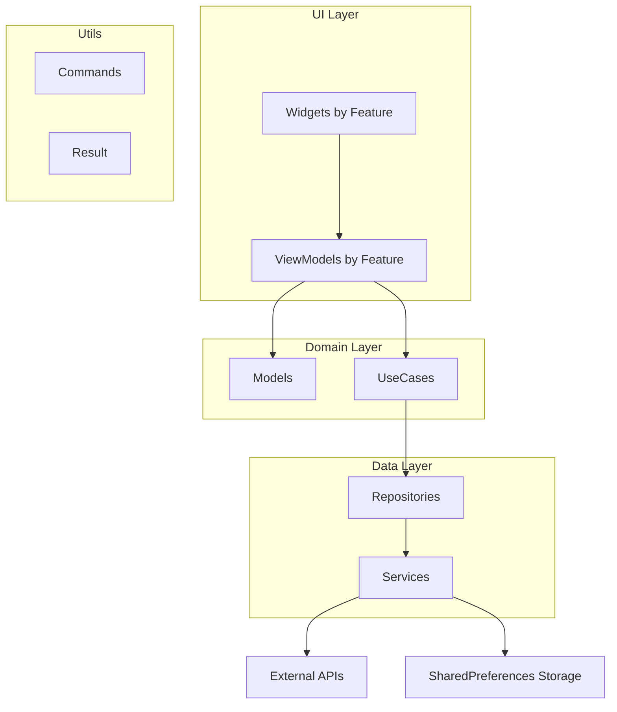

# 🏗️ Arquitetura do Projeto - App Architecture (Google/Flutter)

## 📋 Visão Geral

Este projeto implementa a **App Architecture** proposta pela equipe do Google/Flutter, utilizando o padrão **MVVM (Model-View-ViewModel)** para garantir:

- ✅ **Modularização** clara por features
- ✅ **Reatividade** com ViewModels
- ✅ **Fonte única da verdade** com repositórios
- ✅ **Reutilização** com UseCases
- ✅ **Testabilidade** de todas as camadas

## 🎯 Tecnologias Principais

| Categoria | Tecnologia | Versão | Propósito |
|-----------|------------|--------|-----------|
| **Framework** | Flutter | 3.32.7 | UI Framework |
| **Language** | Dart | 3.8.1 | Linguagem de programação |
| **Estado** | ChangeNotifier + Commands | Built-in | ViewModels reativos |
| **HTTP** | Dio | 5.8.0+1 | Cliente HTTP |
| **Storage** | SharedPreferences | 2.5.3 | Armazenamento local |
| **Navegação** | GoRouter | 16.0.0 | Roteamento declarativo |
| **DI** | GetIt | 8.0.3 | Injeção de dependência |
| **Async** | Result<T> | Custom | Tratamento de erros |

## 🏛️ Arquitetura App Architecture (Google/Flutter)



## 📁 Estrutura do Projeto

```
lib/
├── utils/                    # 🛠️ UTILS - Utilitários e recursos compartilhados
│   ├── command.dart         # Commands para operações
│   └── result.dart          # Result para tratamento de erros
│
├── data/                     # 💾 DATA - Implementações concretas
│   ├── repositories/        # Implementações concretas dos repositórios
│   │   ├── agendamentos/    # 📅 Feature: Agendamentos
│   │   │   ├── agendamentos_repository.dart        # Interface abstrata
│   │   │   └── agendamentos_repository_remote.dart # Implementação concreta
│   │   ├── auth/            # 🔐 Feature: Autenticação
│   │   │   ├── auth_repository.dart                # Interface abstrata
│   │   │   └── auth_repository_remote.dart         # Implementação concreta
│   │   ├── clinicas/        # 🏥 Feature: Clínicas
│   │   │   ├── clinicas_repository.dart            # Interface abstrata
│   │   │   └── clinicas_repository_remote.dart     # Implementação concreta
│   │   └── ...              # Outras features
│   └── services/            # Serviços externos (API, DB, Storage)
│
├── domain/                   # 🏢 DOMAIN - Regras de negócio
│   ├── models/              # Objetos de negócio
│   └── usecases/            # Casos de uso específicos
│
└── ui/                       # 🎨 UI - Interface do usuário
    └── [feature]/
        ├── viewmodels/      # ViewModels reativos
        └── widgets/         # Componentes UI
```

## 🔧 Camadas da Arquitetura

### 🛠️ Utils Layer
**Responsabilidade**: Utilitários e recursos compartilhados

#### Commands
Commands encapsulam operações assíncronas com estado (loading, resultado, erro) de forma reativa. São instanciados diretamente nos ViewModels para máxima simplicidade.

```dart
// command.dart - Implementação base
abstract class Command<T> extends ChangeNotifier {
  bool _running = false;
  bool get running => _running;
  
  Result<T>? _result;
  Result<T>? get result => _result;
  
  bool get error => _result is Error;
  bool get completed => _result is Ok;
  
  Future<void> _execute(CommandAction0<T> action) async {
    if (_running) return;
    _result = null;
    _running = true;
    notifyListeners();
    
    try {
      _result = await action();
    } finally {
      _running = false;
      notifyListeners();
    }
  }
}

// Command sem parâmetros
class Command0<T> extends Command<T> {
  final CommandAction0<T> action;
  Command0(this.action);
  
  Future<void> execute() async {
    await _execute(action);
  }
}

// Command com 1 parâmetro
class Command1<T, A> extends Command<T> {
  final CommandAction1<T, A> action;
  Command1(this.action);
  
  Future<void> execute(A params) async {
    await _execute(() => action(params));
  }
}
```

#### Exemplos de Uso dos Commands

**Exemplo prático - ClinicasViewModel:**

```dart
class ClinicasViewModel extends ChangeNotifier {
  final ClinicaRepository _clinicaRepository;
  final GetClinicasUseCase _getClinicasUseCase;
  final SelecionarClinicaUseCase _selecionarClinicaUseCase;

  // Estado reativo do repositório
  List<ClinicaModel> get clinicas => _clinicaRepository.clinicas;
  ClinicaModel? get clinicaSelecionada => _clinicaRepository.clinicaSelecionada;

  // ✅ Commands instanciados diretamente - máxima simplicidade
  late final getClinicasCommand = Command0(_getClinicas);                    // Sem parâmetros
  late final selecionarClinicaCommand = Command1<void, ClinicaModel>(        // Com 1 parâmetro
    _selecionarClinica,
  );
  late final limparClinicasCommand = Command0(_clinicaRepository.limparClinicas); // Direto no Repository

  ClinicasViewModel(
    this._clinicaRepository,
    this._getClinicasUseCase,
    this._selecionarClinicaUseCase,
  ) {
    // Escutar mudanças no repositório para reatividade automática
    _clinicaRepository.addListener(() => notifyListeners());
  }

  // Métodos privados para Commands que precisam de lógica adicional
  Future<Result<List<ClinicaModel>>> _getClinicas() async {
    return await _getClinicasUseCase.execute();
  }

  Future<Result<void>> _selecionarClinica(ClinicaModel clinica) async {
    return await _selecionarClinicaUseCase.execute(clinica);
  }
}
```

**Como usar Commands na UI:**

```dart
class ClinicasPage extends StatelessWidget {
  final ClinicasViewModel viewModel;
  
  const ClinicasPage({required this.viewModel});
  
  @override
  Widget build(BuildContext context) {
    return Scaffold(
      body: Column(
        children: [
          // Botão para carregar clínicas
          ListenableBuilder(
            listenable: viewModel.getClinicasCommand,
            builder: (context, child) {
              final command = viewModel.getClinicasCommand;
              
              return ElevatedButton(
                onPressed: command.running 
                  ? null                          // Desabilita durante loading
                  : () => command.execute(),      // Executa comando sem parâmetros
                child: command.running 
                  ? CircularProgressIndicator()
                  : Text('Carregar Clínicas'),
              );
            },
          ),
          
          // Lista de clínicas com seleção
          Expanded(
            child: ListenableBuilder(
              listenable: Listenable.merge([
                viewModel,                        // Estado do ViewModel
                viewModel.selecionarClinicaCommand, // Estado do Command
              ]),
              builder: (context, child) {
                final clinicas = viewModel.clinicas;
                final selectCommand = viewModel.selecionarClinicaCommand;
                
                return ListView.builder(
                  itemCount: clinicas.length,
                  itemBuilder: (context, index) {
                    final clinica = clinicas[index];
                    
                    return ListTile(
                      title: Text(clinica.clinicaNome),
                      selected: clinica.id == viewModel.clinicaSelecionada?.id,
                      onTap: selectCommand.running
                        ? null                              // Desabilita durante loading
                        : () => selectCommand.execute(clinica), // Executa com parâmetro
                      trailing: selectCommand.running
                        ? SizedBox(
                            width: 20,
                            height: 20,
                            child: CircularProgressIndicator(strokeWidth: 2),
                          )
                        : null,
                    );
                  },
                );
              },
            ),
          ),
          
          // Listener para tratamento de erros e navegação
          ListenableBuilder(
            listenable: viewModel.selecionarClinicaCommand,
            builder: (context, child) {
              final command = viewModel.selecionarClinicaCommand;
              
              // Reagir ao resultado do comando
              if (command.completed) {
                WidgetsBinding.instance.addPostFrameCallback((_) {
                  ScaffoldMessenger.of(context).showSnackBar(
                    SnackBar(content: Text('Clínica selecionada com sucesso!')),
                  );
                });
              }
              
              if (command.error) {
                WidgetsBinding.instance.addPostFrameCallback((_) {
                  ScaffoldMessenger.of(context).showSnackBar(
                    SnackBar(
                      content: Text('Erro: ${command.result?.asError.error}'),
                      backgroundColor: Colors.red,
                    ),
                  );
                });
              }
              
              return SizedBox.shrink(); // Widget invisível apenas para listener
            },
          ),
        ],
      ),
    );
  }
}
```

**Estados disponíveis nos Commands:**

```dart
// Estado do Command
command.running        // true durante execução
command.completed      // true quando terminou com sucesso  
command.error          // true quando terminou com erro
command.result         // Result<T>? com o resultado (Ok ou Error)

// Exemplo de uso dos estados
if (command.running) {
  return CircularProgressIndicator();
}

if (command.completed) {
  final result = command.result as Ok<List<ClinicaModel>>;
  return Text('${result.value.length} clínicas carregadas');
}

if (command.error) {
  final error = command.result as Error;
  return Text('Erro: ${error.error}', style: TextStyle(color: Colors.red));
}
```

#### Result
Tratamento funcional de erros sem exceptions:

```dart
// result.dart - Sealed class para resultados
sealed class Result<T> {
  const Result();
  factory Result.ok(T value) = Ok._;
  factory Result.error(Exception error) = Error._;
}

final class Ok<T> extends Result<T> {
  final T value;
}

final class Error<T> extends Result<T> {
  final Exception error;
}

// Uso com pattern matching
switch (result) {
  case Ok<User>():
    print('Sucesso: ${result.value}');
  case Error():
    print('Erro: ${result.error}');
}
```

### 💾 Data Layer
**Responsabilidade**: Fonte única da verdade e acesso a dados

#### Repositories (Implementações Concretas)
Repositories são organizados por feature, cada um em sua própria pasta com interface e implementação concreta. Todos estendem `ChangeNotifier` para notificar mudanças de estado automaticamente.

**Estrutura Modular por Feature:**
```
data/repositories/
├── agendamentos/
│   ├── agendamentos_repository.dart        # Interface abstrata
│   └── agendamentos_repository_remote.dart # Implementação concreta
├── auth/
│   ├── auth_repository.dart                # Interface abstrata  
│   └── auth_repository_remote.dart         # Implementação concreta
└── clinicas/
    ├── clinicas_repository.dart            # Interface abstrata
    └── clinicas_repository_remote.dart     # Implementação concreta
```

**Exemplo - Agendamentos Repository:**

```dart
// agendamentos/agendamentos_repository.dart - Interface abstrata
abstract class AgendamentosRepository extends ChangeNotifier {
  List<Agendamento> get agendamentos;
  DateTime? get dataSelecionada;
  
  Future<Result<List<Agendamento>>> getAgendamentosDoDia(DateTime data, int clinicaId);
  Future<Result<void>> atualizarDataSelecionada(DateTime data);
  Future<Result<void>> limparAgendamentos();
}

// agendamentos/agendamentos_repository_remote.dart - Implementação concreta
class AgendamentosRepositoryRemote extends ChangeNotifier implements AgendamentosRepository {
  final ApiClient _medplusApi;

  // Estado interno
  List<Agendamento> _agendamentos = [];
  DateTime? _dataSelecionada;

  @override
  List<Agendamento> get agendamentos => _agendamentos;

  @override
  DateTime? get dataSelecionada => _dataSelecionada;

  AgendamentosRepositoryRemote(this._medplusApi);

  @override
  Future<Result<List<Agendamento>>> getAgendamentosDoDia(DateTime data, int clinicaId) async {
    final result = await _medplusApi.getAgendamentosDoDia(data: data, clinicaId: clinicaId);
    
    switch (result) {
      case Ok<List<Agendamento>>():
        _agendamentos = result.value;
        notifyListeners(); // Notifica mudança de estado
        return Result.ok(result.value);
      case Error():
        return result;
    }
  }

  @override
  Future<Result<void>> atualizarDataSelecionada(DateTime data) async {
    _dataSelecionada = data;
    notifyListeners();
    return Result.ok(null);
  }
}
```

**Exemplo - Auth Repository:**

```dart
// auth/auth_repository.dart - Interface abstrata  
abstract class AuthRepository extends ChangeNotifier {
  User? get user;
  Future<Result<LoginResponse>> login(LoginDto loginDto);
  Future<Result<void>> saveUser(String token);
  Future<Result<User>> get();
  Future<Result<void>> logout();
}

// auth/auth_repository_remote.dart - Implementação concreta
class AuthRepositoryRemote extends ChangeNotifier implements AuthRepository {
  final ApiClient _medplusApi;
  final SharedPreferencesService _preferences;

  @override
  User? get user => _user;
  User? _user;

  AuthRepositoryRemote(this._medplusApi, this._preferences);

  @override
  Future<Result<LoginResponse>> login(LoginDto loginDto) async {
    final result = await _medplusApi.login(loginDto);
    
    switch (result) {
      case Ok<LoginResponse>():
        // Salvar tokens e usuário no SharedPreferences
        await _preferences.saveString(
          LocalStorageConstants.userToken,
          result.value.usuario.token,
        );
        await _preferences.saveJson(
          LocalStorageConstants.loggedUser,
          result.value.usuario.toJson(),
        );
        
        _user = result.value.usuario;
        notifyListeners(); // Notifica mudança de estado
        
        return Result.ok(result.value);
      default:
        return result;
    }
  }

  @override
  Future<Result<User>> get() async {
    final result = await _preferences.getJson(LocalStorageConstants.loggedUser);
    
    switch (result) {
      case Ok<Map<String, dynamic>>():
        final userResult = User.fromJson(result.value);
        _user = userResult;
        notifyListeners();
        return Result.ok(userResult);
      case Error():
        return Result.error(result.error);
    }
  }
}
```

#### Services
Lidam com dados externos ao Flutter/Dart:

- **API Calls**: `MedplusApi` com `Result<T>`
- **SharedPreferences**: `SharedPreferencesService` com métodos tipados
- **Código Nativo**: Chamadas para plataforma

```dart
class MedplusApi {
  final Dio _dio;
  
  const MedplusApi({required Dio dio}) : _dio = dio;
  
  Future<Result<LoginResponse>> login(LoginDto loginDto) async {
    final result = await _dio.post("/auth/login", data: loginDto.toJson());
    
    if (result.statusCode == 200) {
      return Result.ok(LoginResponse.fromJson(result.data["data"]));
    }
    
    return Result.error(Exception(result.data["message"]));
  }
}

class SharedPreferencesService {
  final SharedPreferences _sharedPreferences;
  
  SharedPreferencesService(this._sharedPreferences);
  
  Future<Result<void>> saveJson(String key, Map<String, dynamic> json) async {
    try {
      await _sharedPreferences.setString(key, jsonEncode(json));
      return Result.ok(null);
    } on Exception catch (error) {
      return Result.error(error);
    }
  }
  
  Future<Result<Map<String, dynamic>>> getJson(String key) async {
    try {
      final string = _sharedPreferences.getString(key);
      if (string == null) {
        return Result.error(Exception("Chave $key não encontrada"));
      }
      final Map<String, dynamic> decodedJson = jsonDecode(string);
      return Result.ok(decodedJson);
    } on Exception catch (error) {
      return Result.error(error);
    }
  }
}
```

### 🏢 Domain Layer
**Responsabilidade**: Regras de negócio e contratos

#### Models
Objetos que representam a regra de negócio:

```dart
class User {
  final String id;
  final String name;
  final String email;
  final String? accessToken;
  final String? refreshToken;
  
  const User({
    required this.id,
    required this.name,
    required this.email,
    this.accessToken,
    this.refreshToken,
  });
}
```

#### UseCases
**Quando usar**: Regra de negócio complexa, múltiplos repositórios, reutilização

```dart
class LoginUseCase {
  final AuthRepository _authRepository;
  
  LoginUseCase(this._authRepository);
  
  Future<Result<LoginResponse>> login(LoginDto loginDto) async {
    // 1. Validar dados
    if (loginDto.email.isEmpty || loginDto.password.isEmpty) {
      return Result.error(Exception('Email e senha são obrigatórios'));
    }
    
    // 2. Fazer login via repository
    final result = await _authRepository.login(loginDto);
    
    // 3. Repository já salva automaticamente os dados
    // 4. Repository já notifica mudanças via ChangeNotifier
    
    return result;
  }
}
```

### 🎨 UI Layer
**Responsabilidade**: Modularização por features

#### ViewModels (Reatividade)
ViewModels utilizam **Commands** para encapsular operações com estado reativo automático.

```dart
class AuthViewModel extends ChangeNotifier {
  final IAuthLogic _authLogic;
  final AuthRepository _authRepository;
  final LoginUseCase _loginUseCase;
  final GetUserUsecase _getUserUsecase;

  User? _loggedUser;
  User? get loggedUser => _loggedUser;

  // Commands instanciados diretamente - forma mais simples possível
  late final loginUseCase = Command1(_loginUseCase.login);
  late final getUserUseCase = Command0(_verifyLogingState);
  late final logout = Command0(_logout);

  AuthViewModel(
    this._authRepository,
    this._authLogic,
    this._loginUseCase,
    this._getUserUsecase,
  ) {
    // Escutar mudanças no repositório
    _authRepository.addListener(() {
      _loggedUser = _authRepository.user;
      notifyListeners();
    });
  }

  // Métodos privados chamados pelos commands
  Future<Result<User>> _verifyLogingState() async {
    final result = await _getUserUsecase.get();
    
    switch (result) {
      case Ok<User>():
        _loggedUser = result.value;
        notifyListeners();
        return Result.ok(result.value);
      case Error():
        return result;
    }
  }

  Future<Result<void>> _logout() async {
    return await _authRepository.logout();
  }
}
```

##### Otimização de Commands

**Commands que executam somente uma linha podem referenciar o UseCase/Repository diretamente**, eliminando métodos intermediários desnecessários:

```dart
class AuthViewModel extends ChangeNotifier {
  final AuthRepository _authRepository;
  final LoginUseCase _loginUseCase;
  final GetUserUsecase _getUserUsecase;

  User? _loggedUser;
  User? get loggedUser => _loggedUser;

  // ✅ FORMA OTIMIZADA - Referência direta aos UseCases/Repositories
  late final loginUseCase = Command1(_loginUseCase.login);
  late final getUserUseCase = Command0(_getUserUsecase.get);        // Direto no UseCase
  late final logout = Command0(_authRepository.logout);           // Direto no Repository

  AuthViewModel(
    this._authRepository,
    this._loginUseCase,
    this._getUserUsecase,
  ) {
    _authRepository.addListener(() {
      _loggedUser = _authRepository.user;
      notifyListeners();
    });
  }
  
  // ❌ Métodos intermediários removidos:
  // - _verifyLogingState() → substituído por referência direta
  // - _logout() → substituído por referência direta
}
}
```

**Vantagens dos Commands:**
- ✅ **Estado automático**: `running`, `result`, `error`, `completed`
- ✅ **Reatividade**: Extends `ChangeNotifier` - UI reage automaticamente
- ✅ **Simplicidade**: Instanciação direta no ViewModel
- ✅ **Tipagem**: Suporte completo a generics
- ✅ **Proteção**: Evita execução paralela da mesma operação

#### Widgets
Widgets escutam os Commands do ViewModel para reagir a mudanças de estado.

```dart
class LoginPage extends StatelessWidget {
  final AuthViewModel authViewModel;
  
  const LoginPage({required this.authViewModel});
  
  @override
  Widget build(BuildContext context) {
    return Scaffold(
      body: Column(
        children: [
          // Campos de email e password
          EmailField(),
          PasswordField(),
          
          // Botão que executa o command
          ListenableBuilder(
            listenable: authViewModel.loginUseCase,
            builder: (context, child) {
              final command = authViewModel.loginUseCase;
              
              return ElevatedButton(
                onPressed: command.running 
                  ? null 
                  : () => command.execute(LoginParams(email, password)),
                child: command.running 
                  ? CircularProgressIndicator()
                  : Text('Login'),
              );
            },
          ),
          
          // Listener para navegação e erros
          ListenableBuilder(
            listenable: authViewModel.loginUseCase,
            builder: (context, child) {
              final command = authViewModel.loginUseCase;
              
              // Reagir ao resultado
              if (command.completed) {
                WidgetsBinding.instance.addPostFrameCallback((_) {
                  context.go('/home');
                });
              }
              
              if (command.error) {
                WidgetsBinding.instance.addPostFrameCallback((_) {
                  ScaffoldMessenger.of(context).showSnackBar(
                    SnackBar(content: Text(command.result!.asError.error.toString())),
                  );
                });
              }
              
              return SizedBox.shrink();
            },
          ),
        ],
      ),
    );
  }
}
```

**Como usar Commands na UI:**
- ✅ **ListenableBuilder**: Para reagir às mudanças do Command
- ✅ **command.running**: Para mostrar loading
- ✅ **command.execute()**: Para executar a operação
- ✅ **command.completed**: Para detectar sucesso
- ✅ **command.error**: Para detectar erro
- ✅ **command.result**: Para acessar o resultado

## 🔄 Fluxo de Dados

### Fluxo com Commands


## 🧩 Injeção de Dependências

### Configuração (GetIt)
```dart
// injector.dart
Future<void> setupInjector(ApiConfig apiConfig) async {
  i.addSingleton<ApiConfig>(apiConfig);
  await _injectServices(apiConfig);
  await _injectRepositories();
  await _injectUseCases();
  await _injectViewModels();
}

// Services
Future<void> _injectServices(ApiConfig apiConfig) async {
  final prefs = await SharedPreferences.getInstance();
  i.addLazySingleton<SharedPreferencesService>(
    () => SharedPreferencesService(prefs),
  );
  
  i.addLazySingleton<MedplusApi>(
    () => MedplusApi(dio: _buildBasicDio(apiConfig)),
  );
}

// Repositories - Estrutura modular por feature
Future<void> _injectRepositories() async {
  // Auth Repository
  i.addLazySingleton<AuthRepository>(
    () => AuthRepositoryRemote(i(), i()),
  );
  
  // Agendamentos Repository  
  i.addLazySingleton<AgendamentosRepository>(
    () => AgendamentosRepositoryRemote(i()),
  );
  
  // Clinicas Repository
  i.addLazySingleton<ClinicasRepository>(
    () => ClinicasRepositoryRemote(i()),
  );
}

// UseCases
Future<void> _injectUseCases() async {
  i.addLazySingleton<LoginUseCase>(() => LoginUseCase(i()));
  i.addLazySingleton<GetUserUsecase>(() => GetUserUsecase(i()));
}

// ViewModels
Future<void> _injectViewModels() async {
  i.addLazySingleton(() => AuthViewModel(i(), i(), i()));
}
```

## 🗺️ Navegação (GoRouter)

### Configuração de Rotas
```dart
GoRouter routerConfig = GoRouter(
  redirect: _redirect,
  refreshListenable: injector<AuthRepository>(), // Repository reativo
  initialLocation: AppRoutes.splash,
  routes: [
    GoRoute(
      name: AppRoutes.login,
      path: AppRoutes.login,
      builder: (context, state) => LoginPage(authViewModel: injector()),
    ),
    GoRoute(
      name: AppRoutes.homePage,
      path: AppRoutes.homePage,
      builder: (context, state) => InitialPage(authController: injector()),
    ),
  ],
);
```

### Proteção de Rotas
```dart
Future<String?> _redirect(BuildContext context, GoRouterState state) async {
  // Repository com ChangeNotifier notifica automaticamente mudanças
  final loggedIn = injector<AuthRepository>().user != null;
  final loggingIn = state.matchedLocation == AppRoutes.login;
  
  if (!loggedIn && !loggingIn) {
    return AppRoutes.login; // Redirecionar para login
  }
  
  if (loggingIn && loggedIn) {
    return AppRoutes.homePage; // Já logado, ir para home
  }
  
  return null; // Não redirecionar
}
```

## 🧪 Testing

### Estrutura de Testes
```
test/
├── unit/                    # Testes unitários
│   ├── usecases/           # Testes dos UseCases
│   ├── repositories/       # Testes dos repositórios
│   └── viewmodels/         # Testes dos ViewModels
├── integration/            # Testes de integração
└── mock/                   # Mocks para testes
```

### Exemplo de Teste UseCase
```dart
void main() {
  group('LoginUseCase', () {
    late LoginUseCase useCase;
    late MockAuthRepository mockRepository;
    late MockLocalStorage mockStorage;
    
    setUp(() {
      mockRepository = MockAuthRepository();
      mockStorage = MockLocalStorage();
      useCase = LoginUseCase(mockRepository, mockStorage);
    });
    
    test('deve retornar sucesso quando login for válido', () async {
      // Arrange
      when(mockRepository.login(any, any))
          .thenAnswer((_) async => Success(mockUser));
      
      // Act
      final result = await useCase.execute('test@test.com', '123456');
      
      // Assert
      expect(result.isSuccess, true);
      verify(mockStorage.setAccessToken(any)).called(1);
    });
  });
}
```

## 🚀 Vantagens da App Architecture

### ✅ Benefícios

1. **Modularização por Features**
   - Cada feature tem sua própria pasta
   - ViewModels específicos por tela/funcionalidade
   - Widgets reutilizáveis

2. **Fonte Única da Verdade com Reatividade**
   - Repositories com ChangeNotifier para mudanças automáticas
   - Estado gerenciado pelos Repositories
   - Cache em SharedPreferences com acesso tipado
   - Sincronização automática entre UI e dados

3. **Reutilização com UseCases**
   - Lógica complexa isolada em UseCases
   - Múltiplos repositórios em um local
   - Fácil testabilidade

4. **Reatividade com ViewModels e Commands**
   - Estado reativo com ChangeNotifier
   - Commands para operações com estado automático
   - UI atualizada automaticamente via ListenableBuilder
   - Ciclo de vida gerenciado pelo Flutter

### 🎯 Quando Usar Cada Componente

| Componente | Quando Usar | Exemplo |
|------------|-------------|---------|
| **Command** | Operações UI com estado (loading/resultado) | `loginCommand.execute()` |
| **UseCase** | Lógica complexa, múltiplos repos, reutilização | `LoginUseCase(authRepo, storage)` |
| **Repository** | Sempre - fonte única da verdade | `AuthRepository.login()` |
| **Service** | Acesso a dados externos (API, DB, Storage) | `MedplusApi.post('/login')` |
| **ViewModel** | Estado reativo por feature/tela | `AuthViewModel` com Commands |

## � Migração: ObjectBox → SharedPreferences

### 📋 O que mudou

O projeto **migrou de ObjectBox para SharedPreferences** para simplificar a arquitetura e remover dependências de banco de dados complexo.

#### ❌ Antes (ObjectBox)
```dart
// Complexidade desnecessária
Store db = await getDbInstance(directory);
i.addLazySingleton<IClinicaRepository>(() => ClinicaRepository(db.box()));

// Anotações específicas
@Entity()
class User {
  @Id()
  int id = 0;
  String name;
  // ...
}
```

#### ✅ Agora (SharedPreferences)
```dart
// Simplicidade máxima
i.addLazySingleton<SharedPreferencesService>(
  () => SharedPreferencesService(prefs),
);

// POJOs simples
class User {
  final String id;
  final String name;
  // ...
  
  factory User.fromJson(Map<String, dynamic> json) => User(/*...*/);
  Map<String, dynamic> toJson() => {/*...*/};
}
```

### 🗂️ Arquivos removidos/alterados

**Removidos:**
- ❌ `lib/objectbox.g.dart`
- ❌ `lib/objectbox-model.json`
- ❌ `lib/data/config/database_config.dart`
- ❌ Dependências: `objectbox`, `objectbox_flutter_libs`, `objectbox_generator`

**Alterados:**
- ✅ `lib/data/repositories/auth_repository.dart` - Usa SharedPreferences
- ✅ `lib/data/services/shared_preferences_service.dart` - Service completo
- ✅ `lib/infrastructure/dependencies/injector.dart` - Sem ObjectBox

### 🎯 Benefícios da Migração

1. **Simplicidade**: Sem configuração de banco complexo
2. **Performance**: Acesso direto ao storage nativo
3. **Confiabilidade**: SharedPreferences é battle-tested
4. **Manutenibilidade**: Menos código, menos bugs
5. **Size**: APK menor sem bibliotecas ObjectBox

---

- [Official Flutter App Architecture](https://docs.flutter.dev/app-architecture)
- [MVVM Pattern in Flutter](https://flutter.dev/docs/development/data-and-backend/state-mgmt)
- [ChangeNotifier Documentation](https://api.flutter.dev/flutter/foundation/ChangeNotifier-class.html)
- [GoRouter Documentation](https://docs.flutter.dev/ui/navigation)

---

**Última atualização**: Janeiro 2025  
**Versão da Arquitetura**: App Architecture (Google/Flutter)  
**Padrão Principal**: MVVM com ChangeNotifier + Commands
