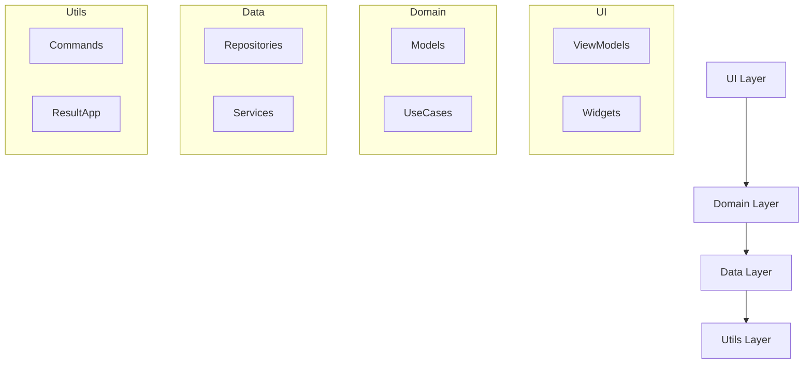

# 📐 Guia: Como Criar Documentação de Arquitetura

## 🎯 Por que documentar a arquitetura?

1. **Facilita onboarding** de novos desenvolvedores
2. **Reduz tempo** de compreensão do projeto
3. **Padroniza decisões** arquiteturais
4. **Serve como referência** para manutenção
5. **Documenta decisões** e trade-offs

## 📋 Estrutura Recomendada

### 1. **Visão Geral**
- Propósito do sistema
- Tecnologias principais
- Contexto de negócio

### 2. **Arquitetura do Sistema**
- Diagrama de alto nível
- Padrões utilizados (Clean Architecture, MVVM, etc.)
- Fluxo de dados

### 3. **Estrutura de Pastas**
```
lib/
├── utils/                    # Utilitários compartilhados
│   ├── command.dart         # Commands para operações reativas
│   └── result.dart          # ResultApp para tratamento de erros
│
├── data/                     # Camada de dados
│   ├── repositories/        # Implementações concretas dos repositórios
│   └── services/            # Serviços externos (API, Storage, etc.)
│
├── domain/                   # Regras de negócio
│   ├── models/              # Objetos de domínio (User, Product, etc.)
│   └── usecases/            # Casos de uso para lógica complexa
│
└── ui/                       # Interface do usuário
    └── [feature]/           # Organização por features
        ├── viewmodels/      # ViewModels reativos
        └── widgets/         # Componentes UI específicos
```

### 4. **Camadas da Aplicação**
- Responsabilidade de cada camada
- Exemplos de código
- Interfaces e contratos

### 5. **Fluxos Importantes**
- Diagramas de sequência
- Casos de uso principais
- Tratamento de erros

### 6. **Padrões e Convenções**
- Nomenclatura
- Estrutura de código
- Boas práticas

## 🛠️ Ferramentas Úteis

### Diagramas
- **Mermaid**: Para diagramas em Markdown
- **Draw.io**: Para diagramas complexos
- **PlantUML**: Para UML

### Exemplo Mermaid:


## ✅ Checklist de Documentação

### Essencial
- [ ] Visão geral do projeto
- [ ] Diagrama de arquitetura
- [ ] Estrutura de pastas explicada
- [ ] Fluxo de dados principal
- [ ] Setup e instalação

### Recomendado
- [ ] Padrões de código
- [ ] Gerenciamento de estado
- [ ] Tratamento de erros
- [ ] Testes
- [ ] Deploy

### Avançado
- [ ] Decisões arquiteturais (ADRs)
- [ ] Performance e métricas
- [ ] Segurança
- [ ] Monitoramento
- [ ] Troubleshooting

## 📝 Dicas de Escrita

### 1. **Use Linguagem Clara**
```markdown
❌ "O sistema utiliza injeção de dependência"
✅ "Usamos GetIt para injetar dependências automaticamente"
```

### 2. **Inclua Exemplos de Código**
```dart
// Sempre acompanhe explicações com código
class AuthViewModel extends ChangeNotifier {
  // Explique o que cada parte faz
}
```

### 3. **Use Diagramas**
- Imagens valem mais que mil palavras
- Fluxos visuais são mais fáceis de entender

### 4. **Mantenha Atualizado**
- Documente mudanças importantes
- Versione a documentação
- Revise periodicamente

## 🔄 Mantendo a Documentação Viva

### 1. **Definition of Done**
- Toda feature nova deve atualizar a documentação
- PRs devem incluir mudanças na documentação

### 2. **Review Process**
- Revisar documentação junto com código
- Validar se explica corretamente a implementação

### 3. **Templates**
Crie templates para:
- Novas features
- Decisões arquiteturais
- Troubleshooting guides

## 📚 Recursos Adicionais

### Livros
- "Clean Architecture" - Robert C. Martin
- "Software Architecture Patterns" - Mark Richards

### Sites
- [C4 Model](https://c4model.com/) - Para documentar arquitetura
- [Architecture Decision Records](https://adr.github.io/)

### Exemplos
- [Flutter Architecture Samples](https://github.com/brianegan/flutter_architecture_samples)
- [Android Architecture Blueprints](https://github.com/android/architecture-samples)

## 🎯 Resultado Final

Uma boa documentação de arquitetura deve:

✅ **Responder perguntas comuns**  
✅ **Ser navegável e organizada**  
✅ **Conter exemplos práticos**  
✅ **Estar sempre atualizada**  
✅ **Ser acessível para diferentes níveis**

---

**Lembre-se**: A melhor documentação é aquela que **realmente é usada** pela equipe!
